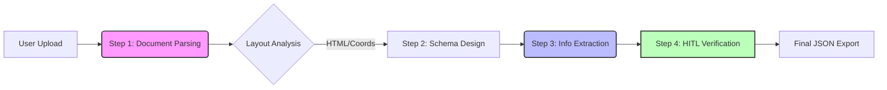

# Upstage DocuParse Architecture
## KC 안전기준 문서 구조화 시스템

### 개요

본 아키텍처는 KC 안전기준(HWP 중심의 비정형 규제문서)을 **정책·AI가 판단할 수 있는 규제 자산**으로 전환하기 위한 4단계 파이프라인을 정의합니다.

핵심 원칙: **Human-In-The-Loop (HITL) 최적화**
- 수식, 그림, 측정단위 등 규제 핵심 정보의 정확성 보장
- AI 판단 근거의 가시화 및 추적성 확보

---



## System Components

### Frontend (Client-Side)
*   **Framework**: React 19 + TypeScript
*   **Build Tool**: Vite 7
*   **Styling**: Tailwind CSS + Lucide Icons
*   **State Management**: React `useReducer` (Local State)
*   **Proxy**: Vite Dev Server (for CORS handling to Upstage API)

---

## Step 1: Document Parsing (문서 디지털화)

### API 정보
- **Endpoint**: `https://api.upstage.ai/v1/document-ai/document-parse`
- **기능**: 문서 레이아웃 분석 + OCR → HTML/Markdown 변환

### 지원 입력 형식
| 구분 | 형식 |
|------|------|
| 이미지 | JPEG, PNG, BMP, TIFF, HEIC |
| 문서 | PDF, DOCX, PPTX, XLSX, **HWP, HWPX** |

### 입력 제약사항
| 항목 | 제한값 |
|------|--------|
| 최대 파일 크기 | 50MB |
| 최대 페이지 수 (동기) | 100 페이지 |
| 최대 페이지 수 (비동기) | 1,000 페이지 |
| 페이지당 최대 픽셀 | 200M pixels |
| 지원 문자셋 | 영숫자, 한글, 한자, 가타카나, 히라가나 |

### 출력 구조
- **Layout Categories → HTML Tags 매핑**
  - paragraph → `<p>`
  - table → `<table>`
  - figure → `<figure>`
  - equation → `<p data-category="equation">` (LaTeX 형식)
  - chart → `<table>` (인식 성공 시) 또는 `<figure>` (실패 시)

### 좌표 체계
- **상대 좌표**: 0.0 ~ 1.0 범위 (소수점 4자리)
- **절대 좌표 변환**: `absolute_x = relative_x × page_width`

### 주요 기능
| 기능 | 파라미터 | 설명 |
|------|----------|------|
| 차트 인식 | 기본 활성화 | 막대/선/파이 차트 → 테이블 변환 |
| 다중 페이지 테이블 병합 | `merge_multipage_tables=true` | 페이지 간 동일 구조 테이블 통합 |
| 수식 인식 | 기본 활성화 | LaTeX 형식으로 추출 |

### KC 문서 적용 시 고려사항
- HWP/HWPX 네이티브 지원으로 변환 손실 최소화
- 수식(LaTeX)과 그림(base64) 별도 관리 필요
- 복잡한 테이블은 `merge_multipage_tables` 활성화 권장

---

## Step 2: Schema Engineering (스키마 설계)

### 접근 방식

#### 방법 1: Schema Generation API (권장)
- **Endpoint**: `https://api.upstage.ai/v1/information-extraction/schema-generation`
- **입력**: 샘플 파일 2~3개 + 추출 의도 설명
- **출력**: JSON Schema 자동 생성
- **활용**: 대표 KC 문서로 초기 스키마 생성 후 수동 보정

#### 방법 2: 수동 설계
- JSON Schema 문법으로 직접 작성
- 외부 LLM(GPT, Gemini) 활용 가능

### 스키마 제약사항
| 항목 | 동기 API | 비동기 API |
|------|----------|------------|
| 최대 속성 수 | 100개 | 5,000개 |
| 최대 문자 수 | 15,000자 | 120,000자 |
| 속성명 총 길이 | 10,000자 (공통) | |

### 지원 타입
- 기본: `string`, `number`, `integer`, `boolean`
- 복합: `array`, `object`
- **제약**: 1차 속성은 `string`/`integer`/`number`/`array`만 가능 (object 불가)
- **제약**: 중첩 배열 불가

### KC 안전기준 스키마 예시

> **주의**: 1차 속성에는 `object` 타입을 사용할 수 없습니다.
> `object`가 필요한 경우 `array`로 래핑하여 items 안에 배치합니다.

```json
{
  "type": "object",
  "properties": {
    "document_title": {
      "type": "string",
      "description": "문서 제목 (예: 안전확인대상생활용품의 안전기준)"
    },
    "revision_date": {
      "type": "string",
      "description": "개정 연월일"
    },
    "product_scope": {
      "type": "string",
      "description": "적용 대상 제품군"
    },
    "safety_criteria": {
      "type": "array",
      "description": "안전기준 항목 목록",
      "items": {
        "type": "object",
        "properties": {
          "test_item": {
            "type": "string",
            "description": "시험 항목명 (예: 점도, 끓는점, 안정성)"
          },
          "conditions": {
            "type": "object",
            "properties": {
              "temperature": {"type": "string", "description": "시험 온도"},
              "time": {"type": "string", "description": "시험 시간"},
              "method": {"type": "string", "description": "시험 방법"}
            }
          },
          "standard_value": {
            "type": "object",
            "properties": {
              "value": {"type": "number", "description": "기준값 (숫자)"},
              "unit_internal": {"type": "string", "description": "내부 정규화 단위 (예: mm2/s)"},
              "unit_display": {"type": "string", "description": "표시용 단위 (예: mm²/s)"}
            }
          }
        },
        "required": ["test_item"]
      }
    },
    "applicable_scope": {
      "type": "array",
      "items": {"type": "string"},
      "description": "적용 대상 (제품군, 등급, 종류)"
    }
  },
  "required": ["safety_criteria"]
}
```

---

## Step 3: Universal Information Extraction (정보 추출)

### API 정보
- **Endpoint**: `https://api.upstage.ai/v1/information-extraction`
- **호환성**: OpenAI Chat Completion API 형식
- **RPS**: 동기 1 / 비동기 2

### 모델 버전
| 모델명 | 설명 |
|--------|------|
| `information-extract` | 최신 안정 버전 (alias) |
| `information-extract-260114` | 2026.01.14 버전 |
| `information-extract-250930` | 2025.09.30 버전 |
| `information-extract-nightly` | 최신 개발 버전 |

### 추출 모드 (Beta)
| 모드 | 설명 | 사용 시점 |
|------|------|----------|
| Standard (기본) | 빠름, 대부분 문서에 정확 | 일반 문서 |
| Enhanced (`mode: "enhanced"`) | 복잡한 테이블, 스캔 불량, 수기 문서 | KC 안전기준 권장 |

### 핵심 기능

#### Location Coordinates (위치 좌표)
- **목적**: 추출값의 원문 위치 추적 → HITL 검증 지원
- **파라미터**: `location: true`, `location_granularity`

| Granularity | 설명 | 성능 |
|-------------|------|------|
| `element` (기본) | HTML 요소 단위 좌표 | 빠름 |
| `word` | 단어 단위 좌표 | 느림, 정밀 |
| `all` | element + word 모두 | 가장 느림 |

- **좌표 형식**: 상대값 (0.0 ~ 1.0)
- **응답 위치**: `tool_calls` → `function: additional_values`

#### Confidence (신뢰도)
- 추출값별 신뢰도 점수 제공
- HITL 우선순위 결정에 활용

### 요청 예시
```python
{
    "model": "information-extract",
    "messages": [
        {
            "role": "user",
            "content": [
                {
                    "type": "file",
                    "file": {"base64": "<base64_encoded_file>"}
                },
                {
                    "type": "text",
                    "text": "KC 안전기준에서 시험조건과 기준값을 추출해주세요."
                }
            ]
        }
    ],
    "response_format": {
        "type": "json_schema",
        "json_schema": {"schema": <스키마>}
    },
    "extra_body": {
        "mode": "enhanced",
        "location": True,
        "location_granularity": "element"
    }
}
```

---

## Step 4: HITL Verification (사람 검토)

### 검증 워크플로우

```
┌─────────────────┐
│ 추출 결과 수신   │
└────────┬────────┘
         ↓
┌─────────────────┐
│ 신뢰도 기반 분류 │
│ - High: 자동승인 │
│ - Low: 검토 대상 │
└────────┬────────┘
         ↓
┌─────────────────┐
│ 검토 UI 표시     │
│ - 원문 하이라이트│
│ - 좌표 기반 시각화│
└────────┬────────┘
         ↓
┌─────────────────┐
│ 사람 수정/승인   │
│ - 수식 편집      │
│ - 단위 검증      │
│ - 값 수정        │
└────────┬────────┘
         ↓
┌─────────────────┐
│ 최종 DB 저장     │
└─────────────────┘
```

### UI 요구사항

1. **원문-추출값 연동 뷰**
   - DB 값 클릭 → 원문 페이지 하이라이트 표시
   - Location Coordinates 활용

2. **편집 기능**
   - 수식(LaTeX) 편집기
   - 단위 정규화 도구 (mm²/s ↔ mm2/s)
   - 그림/차트 검증 뷰어

3. **신뢰도 대시보드**
   - Confidence 기반 검토 우선순위
   - 검토 진행률 모니터링

### 출력 형식

1. **Machine-Readable**: JSON/구조화 DB
2. **Human-Reviewable**: HTML/PDF
   - 그림, 표, 수식 포함
   - 메타데이터 (추출 일시, 원문 위치, 검토자 정보)

---

## 기술 스택 요약

| 단계 | Upstage API | 핵심 파라미터 |
|------|-------------|---------------|
| Step 1 | Document Parsing | `merge_multipage_tables`, output format |
| Step 2 | Schema Generation | 샘플 파일 + 의도 설명 |
| Step 3 | Information Extraction | `mode`, `location`, `location_granularity` |
| Step 4 | (자체 구현) | Confidence threshold, UI 연동 |

---

## 참고 문서

- [Document Parsing](https://console.upstage.ai/docs/capabilities/digitize/document-parsing)
- [Input Requirements](https://console.upstage.ai/docs/capabilities/digitize/input-requirements)
- [Understanding Output](https://console.upstage.ai/docs/capabilities/digitize/understanding-output)
- [Chart Recognition](https://console.upstage.ai/docs/capabilities/digitize/chart-recognition)
- [Universal Information Extraction](https://console.upstage.ai/docs/capabilities/extract/universal-extraction)
- [Writing a Schema](https://console.upstage.ai/docs/capabilities/extract/writing-a-schema)
- [Location Coordinates](https://console.upstage.ai/docs/capabilities/extract/location-coordinates)
- [Confidence](https://console.upstage.ai/docs/capabilities/extract/confidence)
