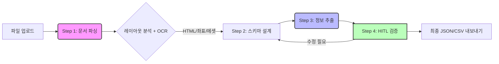

# Upstage DocuParse Architecture

## KC 안전기준 문서 구조화 시스템

### 개요

본 아키텍처는 KC 안전기준(HWP 중심의 비정형 규제문서)을 **정책 및 AI가 판단할 수 있는 구조화된 데이터**로 전환하기 위한 4단계 파이프라인을 정의합니다.

핵심 원칙: **Human-In-The-Loop (HITL) 최적화**
- 수식, 그림, 측정단위 등 규제 핵심 정보의 정확성 보장
- AI 판단 근거의 가시화 및 추적성 확보

---

### 파이프라인 흐름도



```
┌─────────────┐     ┌─────────────┐     ┌─────────────┐     ┌─────────────┐
│  Step 1     │     │  Step 2     │     │  Step 3     │     │  Step 4     │
│  문서 파싱   │────▶│  스키마 설계 │────▶│  정보 추출   │────▶│  HITL 검증  │
│             │     │             │     │             │     │             │
│ Upstage     │     │ Auto-Gen /  │     │ Upstage     │     │ 자체 구현    │
│ Document    │     │ Manual Edit │     │ Information │     │ 사람 확인/   │
│ Parse API   │     │             │     │ Extract API │     │ 수정/내보내기 │
└─────────────┘     └──────┬──────┘     └─────────────┘     └──────┬──────┘
                           │                                       │
                           └───────────── 재추출 (스키마 수정 후) ───┘
```

---

## 시스템 구성

### 프론트엔드 (클라이언트)

| 구분 | 기술 |
|------|------|
| Framework | React 19 + TypeScript 5.8 |
| Build Tool | Vite 7 |
| Styling | Tailwind CSS + Lucide Icons |
| State | React `useReducer` (로컬 상태) |
| 보안 | DOMPurify (HTML 살균 - XSS 방지) |
| 수식 | MathJax (LaTeX 렌더링) |
| 프록시 | Vite Dev Server / Netlify (CORS 처리) |

### 주요 파일 구조

```
├── App.tsx                      # 메인 앱 (4단계 워크플로우 관리)
├── constants.ts                 # API URL, 기본 스키마, 설정값
├── types.ts                     # TypeScript 타입 정의
├── services/
│   └── upstageService.ts        # API 호출, 스키마 검증/자동수정
├── components/
│   ├── FileUploader.tsx          # 파일 업로드 컴포넌트
│   ├── ApiKeyModal.tsx           # API Key 입력 모달
│   ├── SchemaBuilder.tsx         # 스키마 편집기 (Visual + Code)
│   └── ExtractionViewer.tsx      # 추출 결과 검증 뷰어
├── vite.config.ts               # Vite 프록시 설정
└── netlify.toml                 # Netlify 배포 프록시 설정
```

---

## Step 1: Document Parsing (문서 디지털화)

> 공식 문서: [Document Digitization](https://console.upstage.ai/docs/capabilities/digitize#document-digitization)

### API 정보
- **Endpoint**: `https://api.upstage.ai/v1/document-ai/document-parse`
- **방식**: `multipart/form-data` POST
- **기능**: 문서 레이아웃 분석 + OCR → HTML/Markdown 변환

### 지원 입력 형식
| 구분 | 형식 |
|------|------|
| 이미지 | JPEG, PNG, BMP, TIFF, HEIC |
| 문서 | PDF, DOCX, PPTX, XLSX, **HWP, HWPX** |

### 입력 제약사항
| 항목 | 제한값 |
|------|--------|
| 최대 파일 크기 | **50MB** |
| 최대 페이지 수 (동기) | 100 페이지 |
| 최대 페이지 수 (비동기) | 1,000 페이지 |
| 페이지당 최대 픽셀 | 200M pixels |
| 지원 문자셋 | 영숫자, 한글, 한자, 가타카나, 히라가나 |

### 출력 구조

```
문서 파싱 결과
├── content
│   ├── html       ← 표/수식 포함 구조화 HTML
│   ├── markdown   ← Markdown 텍스트
│   └── text       ← 순수 텍스트
├── elements[]     ← 개별 요소 목록
│   ├── category   ← paragraph, table, figure, equation, chart...
│   ├── content    ← 요소별 HTML/Markdown/Text
│   ├── coordinates← 페이지 내 위치 (상대 좌표 0.0~1.0)
│   └── base64_encoding ← 이미지 데이터 (표/그림/수식)
└── usage
    └── pages      ← 처리된 페이지 수
```

**Layout Category → HTML 태그 매핑:**

| Category | HTML 태그 | 설명 |
|----------|-----------|------|
| paragraph | `<p>` | 일반 텍스트 |
| table | `<table>` | 표 |
| figure | `<figure>` | 그림/이미지 |
| equation | `<p data-category="equation">` | 수식 (LaTeX) |
| chart | `<table>` 또는 `<figure>` | 차트 (인식 성공/실패) |
| heading1 | `<h1>` | 제목 |
| list | `<ul>`/`<ol>` | 목록 |

### 주요 파라미터

| 파라미터 | 설명 | 본 앱 설정 |
|---------|------|-----------|
| `model` | 파싱 모델 | `document-parse-nightly` |
| `output_formats` | 출력 형식 | `["html"]` |
| `coordinates` | 좌표 포함 여부 | `true` |
| `merge_multipage_tables` | 다중 페이지 표 병합 | `true` |
| `chart_recognition` | 차트 인식 | `true` |
| `base64_encoding` | Base64 이미지 대상 | `["figure","chart","table","equation"]` |

### 좌표 체계
- **상대 좌표**: 0.0 ~ 1.0 범위 (소수점 4자리)
- **절대 좌표 변환**: `absolute_x = relative_x * page_width`
- **형식**: 4개 꼭짓점 `[top-left, top-right, bottom-right, bottom-left]`

---

## Step 2: Schema Engineering (스키마 설계)

> 공식 문서: [Writing a Schema](https://console.upstage.ai/docs/capabilities/extract/writing-a-schema)

### 접근 방식

```
┌─────────────────────────────────────────┐
│            스키마 설계 방법               │
├──────────────┬──────────────────────────┤
│  자동 생성    │  수동 설계               │
│              │                          │
│  AI가 문서를  │  Visual 편집기로          │
│  분석하여     │  필드 추가/수정           │
│  스키마 제안  │  또는 JSON 직접 작성      │
│              │                          │
│  → 검증 후   │  → 프리셋(KC Safety,     │
│    자동 수정  │    Invoice) 활용 가능     │
└──────────────┴──────────────────────────┘
```

#### 방법 1: Schema Generation API
- **Endpoint**: `https://api.upstage.ai/v1/information-extraction/schema-generation/chat/completions`
- **입력**: 샘플 문서 + 추출 의도 설명
- **출력**: JSON Schema 자동 생성
- **활용**: 대표 문서로 초기 스키마 생성 후 수동 보정

#### 방법 2: 수동 설계
- Visual 편집기에서 GUI로 필드 추가/삭제/수정
- Code 편집기에서 JSON Schema 직접 작성
- 프리셋 스키마(KC Safety, Invoice) 로드 후 수정

### 스키마 제약사항 (Upstage API)

| 항목 | 동기 API | 비동기 API |
|------|----------|------------|
| 최대 속성 수 | 100개 | 5,000개 |
| 최대 문자 수 | 15,000자 | 120,000자 |
| 속성명 총 길이 | 10,000자 (공통) | |

### 지원 타입 및 제약

```
허용 타입
├── 기본 타입: string, number, integer, boolean
├── 복합 타입: array
└── 특수: object (array의 items로만 사용 가능)

타입 제약 규칙
├── object는 property 타입으로 사용 불가 (어떤 레벨에서든)
│   ✅ { "type": "array", "items": { "type": "object", ... } }
│   ❌ { "type": "object", "properties": { "foo": { "type": "object" } } }
├── array items 내부 properties도 primitive 또는 array만 가능
├── 중첩 배열 불가 (array 안에 array 불가)
└── 속성명 총 문자수 10,000자 이하
```

> **중첩 구조 해결 방법**: 접두사 기반 플랫화
> `conditions.temperature` → `condition_temperature`

### KC 안전기준 스키마 예시

```json
{
  "type": "object",
  "properties": {
    "document_title": {
      "type": "string",
      "description": "문서 제목 (예: 안전확인대상생활용품의 안전기준)"
    },
    "revision_date": {
      "type": "string",
      "description": "개정 연월일"
    },
    "product_scope": {
      "type": "string",
      "description": "적용 대상 제품군"
    },
    "safety_criteria": {
      "type": "array",
      "description": "안전기준 항목 목록",
      "items": {
        "type": "object",
        "properties": {
          "test_item": { "type": "string", "description": "시험 항목명" },
          "condition_temperature": { "type": "string", "description": "시험 온도" },
          "condition_time": { "type": "string", "description": "시험 시간" },
          "condition_method": { "type": "string", "description": "시험 방법" },
          "standard_value": { "type": "string", "description": "기준값" },
          "standard_unit": { "type": "string", "description": "단위" }
        },
        "required": ["test_item"]
      }
    }
  },
  "required": ["safety_criteria"]
}
```

### 스키마 자동 검증 및 수정

본 앱은 추출 실행 전 스키마를 자동으로 검증합니다:

1. **`validateSchema()`**: 모든 레벨에서 `object` property 사용 여부, 중첩 배열, 속성 수/문자 수 제한 검사
2. **`autoFixSchema()`**: 검증 실패 시 `object` property를 접두사 기반 flat 속성으로 자동 변환

---

## Step 3: Universal Information Extraction (정보 추출)

> 공식 문서: [Information Extraction](https://console.upstage.ai/docs/capabilities/extract#information-extraction)

### API 정보
- **Endpoint**: `https://api.upstage.ai/v1/information-extraction/chat/completions`
- **호환성**: OpenAI Chat Completion API 형식
- **RPS**: 동기 1 / 비동기 2

### 모델 버전

| 모델명 | 설명 |
|--------|------|
| `information-extract` | 최신 안정 버전 (alias) |
| `information-extract-260114` | 2026.01.14 버전 |
| `information-extract-250930` | 2025.09.30 버전 |
| `information-extract-nightly` | 최신 개발 버전 |

### 추출 모드 (Beta)

| 모드 | 설명 | 사용 시점 |
|------|------|----------|
| Standard (기본) | 빠름, 대부분 문서에 정확 | 일반 문서 |
| Enhanced | 복잡한 테이블, 스캔 불량, 수기 문서 | KC 안전기준 권장 |

### 핵심 기능

#### Location Coordinates (위치 좌표)

> 공식 문서: [Location Coordinates](https://console.upstage.ai/docs/capabilities/extract/location-coordinates)

추출된 값이 원문 어디에 있는지 좌표로 추적합니다. HITL 검증에서 "이 값이 정말 맞나?" 확인할 때 사용합니다.

| Granularity | 설명 | 특징 |
|-------------|------|------|
| `element` (기본) | HTML 요소 단위 좌표 | 빠름 |
| `word` | 단어 단위 좌표 | 느리지만 정밀 |
| `all` | element + word 모두 | 가장 느림 |

- **좌표 형식**: 4개 꼭짓점, 상대값 (0.0 ~ 1.0)
- **응답 위치**: `choices[0].message.tool_calls[0].function.arguments`

#### Confidence (신뢰도)

> 공식 문서: [Confidence](https://console.upstage.ai/docs/capabilities/extract/confidence)

추출된 각 값에 `high` 또는 `low` 신뢰도를 부여합니다. `low`인 값은 UI에서 경고 표시되어 우선 검토 대상이 됩니다.

- **응답 위치**: `tool_calls[0].function.arguments` 내 각 필드의 `confidence` 속성

### 요청 형식 (Raw REST API)

본 앱은 OpenAI SDK 없이 직접 `fetch`로 호출하므로, 아래와 같은 JSON 형식을 사용합니다:

```json
{
  "model": "information-extract",
  "messages": [
    {
      "role": "user",
      "content": [
        {
          "type": "image_url",
          "image_url": { "url": "data:application/octet-stream;base64,<BASE64>" }
        }
      ]
    }
  ],
  "response_format": {
    "type": "json_schema",
    "json_schema": {
      "name": "document_schema",
      "schema": { ... }
    }
  },
  "mode": "enhanced",
  "confidence": true,
  "location": true,
  "location_granularity": "element"
}
```

> **참고**: Python OpenAI SDK 사용 시 `mode`, `confidence`, `location`, `location_granularity`는 `extra_body` 파라미터로 전달합니다. Raw REST API에서는 요청 본문 최상위에 직접 포함합니다.

### 응답 구조

```
Extraction Response
├── choices[0].message.content    ← 추출된 데이터 (JSON 문자열)
└── choices[0].message.tool_calls ← 메타데이터
    └── [0].function
        ├── name: "additional_values"
        └── arguments               ← 각 필드별 신뢰도/좌표/페이지 정보
            ├── field_name
            │   ├── _value           ← 추출된 값
            │   ├── confidence       ← "high" | "low"
            │   ├── coordinates      ← [{x,y}, {x,y}, {x,y}, {x,y}]
            │   ├── page             ← 페이지 번호
            │   └── word_coordinates ← [[{x,y},...], ...] (word 모드)
            └── ...
```

---

## Step 4: HITL Verification (사람 검토)

### 검증 워크플로우

```
┌─────────────────┐
│ 추출 결과 수신   │
└────────┬────────┘
         ▼
┌─────────────────┐
│ 신뢰도 기반 분류 │
│ - High: 자동승인 │
│ - Low: 검토 대상 │
└────────┬────────┘
         ▼
┌─────────────────┐
│ 검토 UI 표시     │
│ - 원문 하이라이트│
│ - 좌표 기반 시각화│
│ - 에셋↔HTML 연동│
└────────┬────────┘
         ▼
┌─────────────────┐
│ 사람 수정/승인   │
│ - 값 수정        │
│ - 수식 확인      │
│ - 단위 검증      │
└────────┬────────┘
         ▼
┌─────────────────────────┐
│ 내보내기                 │
│ - JSON (구조화 데이터)    │
│ - CSV (스프레드시트 호환) │
└─────────────────────────┘
```

### ExtractionViewer UI 구성

```
┌──────────────────────────┬──────────────────────────┐
│     좌측 패널 (원문)       │     우측 패널 (검증)       │
│                          │                          │
│  [HTML Source] [Overlay]  │  ── Extracted Data ──    │
│                          │  ┌─────────────────────┐ │
│  파싱된 HTML 문서 표시     │  │ field: value  [edit] │ │
│  - 에셋 클릭 시           │  │ field: value  ⚠ low │ │
│    해당 요소 하이라이트    │  └─────────────────────┘ │
│                          │                          │
│  이미지 파일인 경우:       │  ── Detected Assets ──   │
│  - 좌표 기반 바운딩 박스   │  ┌─────────────────────┐ │
│  - 단어 단위 하이라이트    │  │ [📊 table] Page 1    │ │
│                          │  │ [📈 figure] Page 2   │ │
│                          │  │ [∑ equation] Page 3  │ │
│                          │  └─────────────────────┘ │
└──────────────────────────┴──────────────────────────┘
```

### 주요 인터랙션

1. **추출값 클릭** → 이미지 파일인 경우 좌표 기반 바운딩 박스로 원문 위치 표시
2. **에셋 클릭** → HTML Source 탭으로 전환 후 `data-element-id`로 해당 요소로 스크롤 및 하이라이트
3. **값 수정** → 인라인 편집 후 실시간 반영
4. **낮은 신뢰도** → 경고 배지 표시 (`⚠ Check`)

### 보안

- 모든 `dangerouslySetInnerHTML`에 **DOMPurify** 적용 (XSS 방지)
- CSV 내보내기 시 수식 주입 방지 (`=`, `+`, `-`, `@` 앞에 `'` 추가)
- UTF-8 BOM 포함으로 한글 Excel 호환성 확보

---

## 기술 스택 요약

| 단계 | Upstage API | 핵심 파라미터 | 본 앱 구현 |
|------|-------------|---------------|-----------|
| Step 1 | Document Parsing | `merge_multipage_tables`, `base64_encoding` | `parseDocument()` |
| Step 2 | Schema Generation | 문서 + 텍스트 프롬프트 | `generateSchema()` + `autoFixSchema()` |
| Step 3 | Information Extraction | `mode`, `location`, `confidence` | `extractInformation()` |
| Step 4 | (자체 구현) | Confidence threshold, UI 연동 | `ExtractionViewer` |

---

## 프록시 설정

### 개발 환경 (Vite)

`vite.config.ts`에서 CORS 프록시 설정:
- `/api/upstage/*` → `https://api.upstage.ai/v1/*`

### 배포 환경 (Netlify)

`netlify.toml`에서 리디렉트 프록시:
- `/api/upstage/:splat` → `https://api.upstage.ai/v1/:splat` (status 200)

---

## 참고 문서

- [Document Digitization](https://console.upstage.ai/docs/capabilities/digitize#document-digitization)
- [Document Parsing](https://console.upstage.ai/docs/capabilities/digitize/document-parsing)
- [Input Requirements](https://console.upstage.ai/docs/capabilities/digitize/input-requirements)
- [Understanding Output](https://console.upstage.ai/docs/capabilities/digitize/understanding-output)
- [Chart Recognition](https://console.upstage.ai/docs/capabilities/digitize/chart-recognition)
- [Information Extraction](https://console.upstage.ai/docs/capabilities/extract#information-extraction)
- [Universal Information Extraction](https://console.upstage.ai/docs/capabilities/extract/universal-extraction)
- [Writing a Schema](https://console.upstage.ai/docs/capabilities/extract/writing-a-schema)
- [Location Coordinates](https://console.upstage.ai/docs/capabilities/extract/location-coordinates)
- [Confidence](https://console.upstage.ai/docs/capabilities/extract/confidence)
